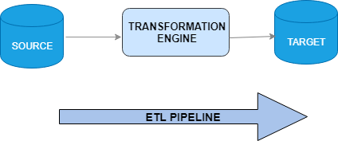



### Definition
A pipeline is a series of processes that filter or transform data.
A pipeline consists of zero, one or more stages/processes. 
The first process takes raw input data, in fact something, 
then sends its results to the second process, and so on, ending with the final result produced by the last process in progress.
The pipelines are fast, taking anywhere from a few seconds to a few hours to process a set of data.



### Installation
``` 
composer require php-etl/pipeline
```

### Usage
In our case, the pipeline is our ETL (Extract, Transform, Load)

```
<?php

use Kiboko\Component\Pipeline\PipelineRunner;
use Kiboko\Component\Pipeline\Pipeline;
use Kiboko\Component\Flow\Csv\Safe\Extractor;
use Kiboko\Component\Flow\Csv\Safe\Loader;

$runner = new PipelineRunner;
$pipeline = (new Pipeline($runner))
    ->extract(new Extractor('path/to/file'))
    ->load(new Loader('path/to/file'))
    ->run();
```


